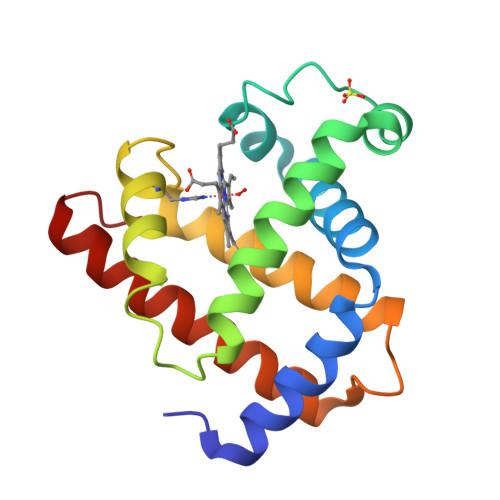

# 🔭 Scientific Data Dashboard

<!-- START_TIME -->
⏱ Last Updated: 2026-02-20 18:52 UTC
<!-- END_TIME -->

---

## 🖼️ Visual Data

<table width="100%">
<tr>
<td width="50%" valign="top" align="center">

### 🌌 Wikimedia Picture of the Day
<!-- START_APOD -->

**Irish peasant farmer smoking pipe, 1890s.jpg**

_This photochrom print depicts a male Irish peasant farmer standing in doorway while smoking a pipe. Today is International Pipe Smoking Day._

_Wikimedia Picture of the Day_
<!-- END_APOD -->

</td>
<td width="50%" valign="top" align="center">

### 🧬 Protein Structure (RCSB PDB)
<!-- START_PROTEIN -->

🧬 **Haemoglobin** &nbsp; `2HHB`

_([View 3D Structure](https://www.rcsb.org/structure/2HHB))_
<!-- END_PROTEIN -->

</td>
</tr>
</table>

---

## 📡 Live Research Feed

<!-- START_TICKER -->
| # | Field | Latest Paper (auto-updated every 6 hrs) |
|:-:|:------|:-----------------------------------------|
| 1 | 🔵 Astrophysics | [Bremsstrahlung emission from nuclear reactions in compact stars](https://arxiv.org/abs/1912.12092v1) |
| 2 | 🔵 Astrophysics | [Towards a warped inflationary brane scanning](https://arxiv.org/abs/0812.4649v3) |
| 3 | 🟣 Quantum Physics | [A Study of Entanglement and Ansatz Expressivity for the Transverse-Field Ising](https://arxiv.org/abs/2602.17662v1) |
| 4 | 🟣 Quantum Physics | [Benchmarking quantum phase-space methods for near-resonant light propagation](https://arxiv.org/abs/2602.17660v1) |
| 5 | 🟢 AI / CS | [Sink-Aware Pruning for Diffusion Language Models](https://arxiv.org/abs/2602.17664v1) |
| 6 | 🟢 AI / CS | [CLEF HIPE-2026: Evaluating Accurate and Efficient Person-Place Relation Extrac](https://arxiv.org/abs/2602.17663v1) |
| 7 | 🟡 Economics | [Lies, Labels, and Mechanisms](https://arxiv.org/abs/2602.16973v1) |
| 8 | 🟡 Economics | [Can Wearable Exoskeletons Reduce Gender and Disability Gaps in the Constructio](https://arxiv.org/abs/2602.16631v1) |
| 9 | 🔴 Neuroscience | [Probability-Invariant Random Walk Learning on Gyral Folding-Based Cortical Sim](https://arxiv.org/abs/2602.17557v1) |
| 10 | 🔴 Neuroscience | [Construction of a classification model for dementia among Brazilian adults age](https://arxiv.org/abs/2602.16887v1) |
<!-- END_TICKER -->

---

## 🌍 Earth & Space

<table width="100%">
<tr>
<td width="62%" valign="top">

### 🌋 Global Seismic Activity (M5+)
<!-- START_EARTHQUAKES -->

<!-- END_EARTHQUAKES -->

</td>
<td width="38%" valign="top">

### 🛰️ ISS Live Position
<!-- START_ISS -->

<!-- END_ISS -->

</td>
</tr>
<tr>
<td colspan="2" valign="top">

### 💨 Solar Wind Speed
<!-- START_SOLAR -->

<!-- END_SOLAR -->

</td>
</tr>
</table>

---

## 🌱 Climate & Energy

<table width="100%">
<tr>
<td width="50%" valign="top">

### 🏭 CO₂ Emissions by Country
<!-- START_CLIMATE -->

<!-- END_CLIMATE -->

</td>
<td width="50%" valign="top">

### ⚡ Renewable Energy Share
<!-- START_ENERGY -->

<!-- END_ENERGY -->

</td>
</tr>
<tr>
<td colspan="2" valign="top">

### 🌡️ Global Temperature Anomaly (2010–2024)
<!-- START_TEMP -->

<!-- END_TEMP -->

</td>
</tr>
</table>

---

## 💹 Global Economics

<table width="100%">
<tr>
<td width="50%" valign="top">

### 📈 GDP Growth Rate (Latest)
<!-- START_GDP -->

<!-- END_GDP -->

</td>
<td width="50%" valign="top">

### 💸 Inflation Rates (Latest)
<!-- START_INFLATION -->

<!-- END_INFLATION -->

</td>
</tr>
<tr>
<td colspan="2" valign="top">

### ⚖️ Trade Balance — Major Economies
<!-- START_TRADE -->

<!-- END_TRADE -->

</td>
</tr>
</table>

---

## 📈 Contribution Activity

---

**Data Sources:**
[Wikimedia Commons](https://commons.wikimedia.org) · [USGS](https://earthquake.usgs.gov) · [NOAA SWPC](https://www.swpc.noaa.gov) · [arXiv](https://arxiv.org) · [World Bank](https://data.worldbank.org) · [NASA GISS](https://data.giss.nasa.gov) · [RCSB PDB](https://www.rcsb.org)

*Auto-updated every 6 hours via GitHub Actions*

